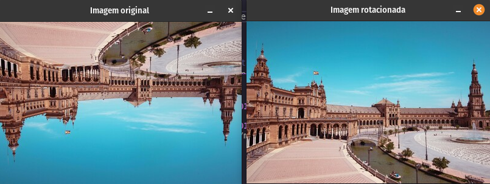

# Flipping out

Como brincadeira, alguém virou uma imagem de um álbum de fotos de uma viagem a Sevilha de cabeça para baixo e de trás para a frente! Agora, precisamos endireitar a imagem, invertendo-a.

Usando os métodos NumPy aprendidos no curso, vire a imagem horizontalmente e verticalmente. Em seguida, exiba a imagem corrigida usando a show_image() function.
NumPy já foi importado como np.

## Resultado obtido em C++

---

### Código fornecido em Python

~~~ Python
# Flip the image vertically
seville_vertical_flip = ____.____(flipped_seville)
~~~
