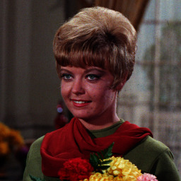
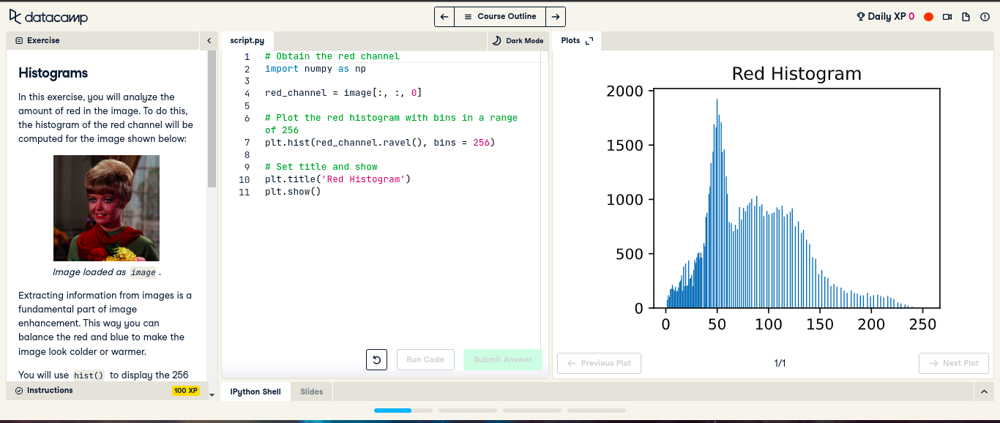
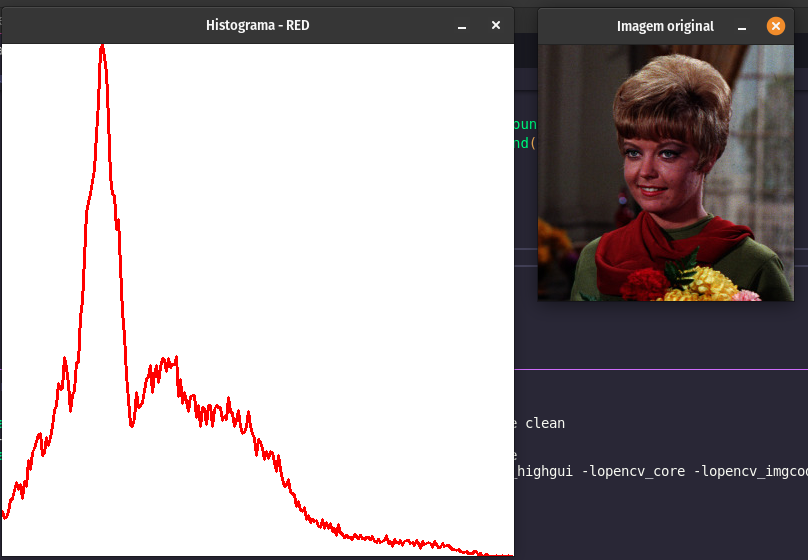

# Histograms

Neste exercício, você analisará a quantidade de vermelho na imagem. Para isso, será calculado o histograma do canal vermelho para a imagem mostrada abaixo:

Extrair informações de imagens é uma parte fundamental do aprimoramento de imagens. Dessa forma, você pode equilibrar o vermelho e o azul para deixar a imagem mais fria ou mais quente.

Você usará hist() para exibir as 256 diferentes intensidades da cor vermelha. E ravel() para tornar esses valores de cores uma matriz de uma dimensão plana.

Matplotlib é pré-carregado como plte Numpy como np.

Lembre-se que se quisermos obter a cor verde de uma imagem faríamos o seguinte:

> green = image[:, :, 1]

## comparação de histogramas (Python vs C++)

 **Python** |  **C++**
 ---        | ---
  | 

---

### Código fornecido em Python

~~~ Python
# Obtain the red channel
red_channel = image[____, ____, ____]

# Plot the red histogram with bins in a range of 256
plt.____(____.____, bins=____)

# Set title and show
plt.title('Red Histogram')
plt.show()
~~~

## [Documentação auxiliar](https://docs.opencv.org/3.4/d8/dbc/tutorial_histogram_calculation.html)
