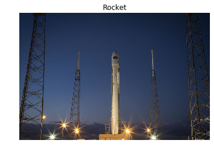

# RGB para grayscale

Neste exercício você irá carregar uma imagem do módulo scikit-image datae torná-la em escala de cinza, então comparar ambas na saída.

Pré-carregamos uma função show_image(image, title='Image')que exibe a imagem usando o Matplotlib. Você pode verificar mais sobre seus parâmetros usando ?show_image()ou help(show_image)no console.

## Resultado obtido em C++

---

### Código fornecido em Python

~~~ Python
# Import the modules from skimage
from skimage import ____, ____

# Load the rocket image
rocket = data.____()

# Convert the image to grayscale
gray_scaled_rocket = color.____(____)

# Show the original image
show_image(rocket, 'Original RGB image')

# Show the grayscale image
show_image(gray_scaled_rocket, 'Grayscale image')
~~~
