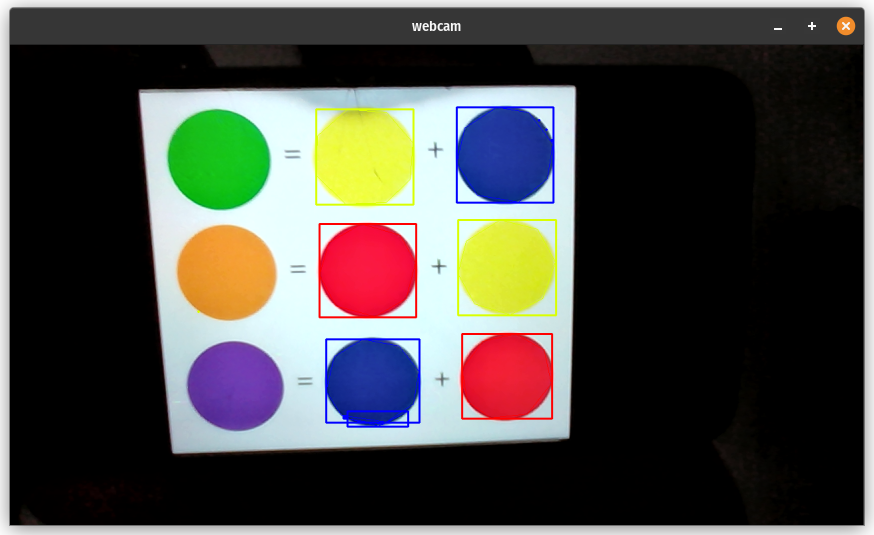

# Mini projeto de visão computacional

## Identificando cores em tempo real com C++ (Track colors)

### Configurações

---

* POP_OS 22.04 LTS

* VSCODE

* Biblioteca OpenCV
  * Instalação [aqui](https://github.com/isaacvssilva/Learning-C-Plus-Plus/blob/main/recursos/install-opencv-cpp.md).

## Descrição

---

O objetivo desse programa é identificar as cores vermelho, azul e amarelo, com um range mínimo e máximo das 3 cores a serem identificadas, através da webcam. Dessa forma, podemos rastrear diferentes níveis de intensidade das cores definidas.

## Resultados




Execução do programa:

```sh
make
```

Encerrar captura:

```sh
pressionar "q" ou "esc" no teclado
```

deletar binário:

```sh
make clean
```

Inspiração do prejeto [aqui](https://suzana-svm.medium.com/vis%C3%A3o-computacional-detec%C3%A7%C3%A3o-de-cores-em-tempo-real-utilizando-python-e-opencv-a466444d40e).
